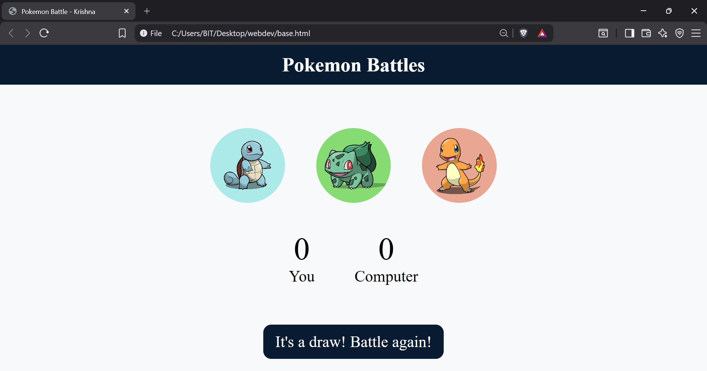
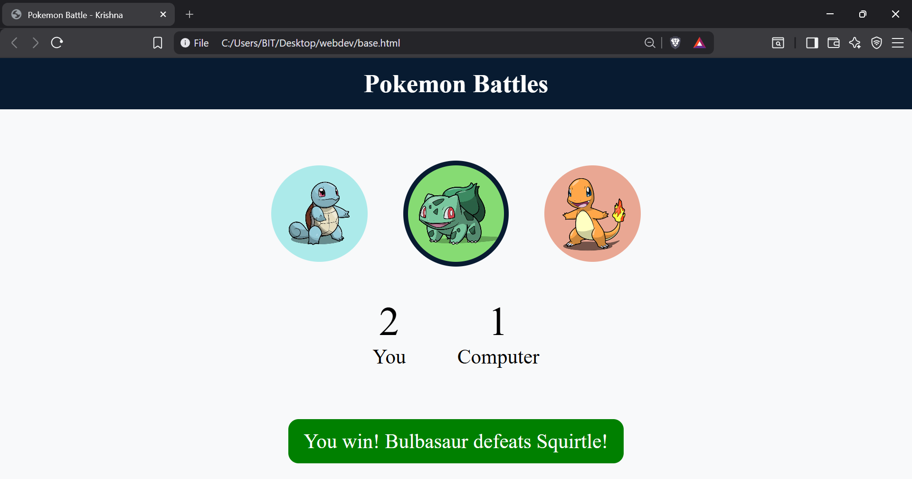
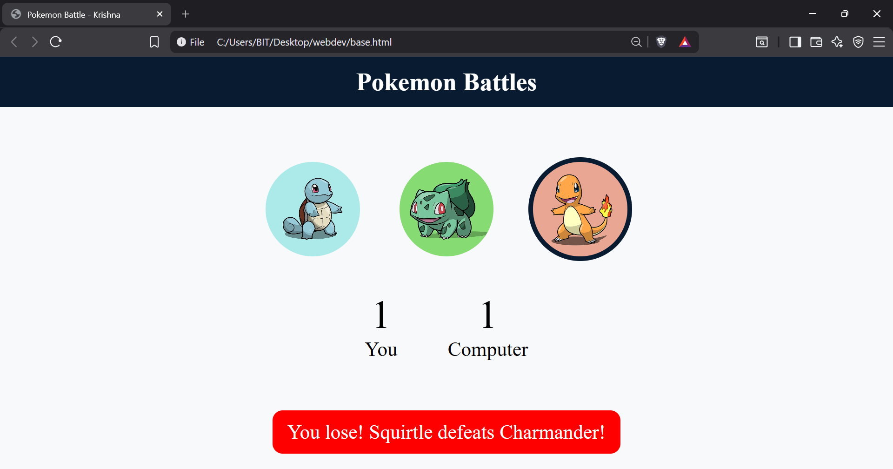
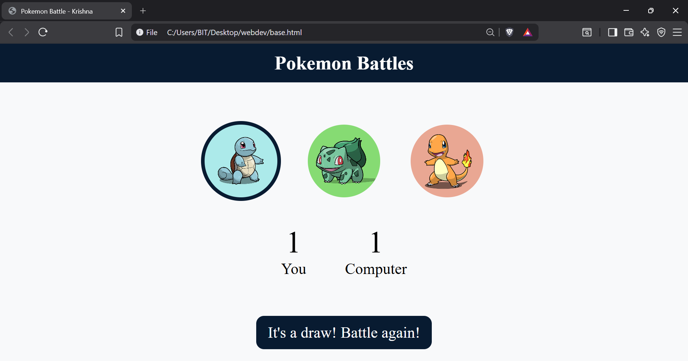

#  Pokémon Battle Game

A fun and interactive **Pokémon-themed battle game** inspired by the classic **Rock-Paper-Scissors**. Instead of Rock, Paper, and Scissors, players battle using three iconic Pokémon based on their elemental type advantages.

-  Squirtle
-  Bulbasaur
-  Charmander

Built using **HTML, CSS, and JavaScript**, this project demonstrates DOM manipulation, event handling, game logic, random choice generation, and responsive frontend design.

---

##  Battle Rules

The game follows Pokémon type effectiveness:

- 💧 **Squirtle** defeats 🔥 **Charmander**
- 🌿 **Bulbasaur** defeats 💧 **Squirtle**
- 🔥 **Charmander** defeats 🌿 **Bulbasaur**

If both players choose the same Pokémon, the battle ends in a draw.

---

##  Screenshots

### Home Screen

---

### You Win

---

### Computer Wins

---

### Draw Match

---

##  Features

-  Pokémon-themed gameplay
-  Interactive battle interface
-  Random computer opponent
-  Live score tracking
-  Instant win, lose, and draw detection
-  Dynamic battle result messages
-  Smooth hover animations
-  Responsive and clean UI

---

## 🛠️ Technologies Used

- HTML5
- CSS3
- JavaScript (ES6)

---

##  Concepts Practiced

- DOM Manipulation
- Event Handling
- Conditional Logic
- JavaScript Functions
- Random Number Generation
- Game State Management
- Dynamic UI Updates
- Responsive Web Design

---

## 👨‍💻 Author

**Krishna Verma**

